# System Architecture

This document describes the end-to-end system architecture of **pose_est_v2** — a
real-time exercise classifier that runs on a Raspberry Pi 5, with an offline
training pipeline and a post-session RAG coaching chat.

## Overview Diagram

```mermaid
flowchart LR
    %% ================= BUILD TIME (Mac / Colab) =================
    subgraph BUILD["🛠️ Build Time — Mac / Colab (offline, heavy deps)"]
        direction TB
        TRAINVIDS["📹 174 Training Videos<br/>(5 people · 9 exercises)"]
        PREP["preprocess_train_videos.py<br/>flatten Person1-5 → canonical names"]
        EXTRACT["extract_video_keypoints.py<br/>BlazePose → normalized .npy"]
        WINDOWS["build_windows.py<br/>30-frame windows + 5× augmentation"]
        TRAIN["train_classifier.py<br/>dual-head LSTM (2 layers)"]
        EXPORT["export_models.py<br/>.keras → .tflite"]

        PDFS["📄 PDF Manuals<br/>Conditioning + Behaviour"]
        BUILDKB["build_knowledge_base.py<br/>PyMuPDF + sentence-transformers"]

        TRAINVIDS -->|"raw videos"| PREP
        PREP --> EXTRACT
        EXTRACT -->|"keypoints"| WINDOWS
        WINDOWS -->|"X_train.npy"| TRAIN
        TRAIN -->|".keras"| EXPORT
        PDFS -->|"load + chunk"| BUILDKB
    end

    %% ================= ARTIFACTS (handoff) =================
    TFLITE["classifier.tflite<br/>9 exercise + 2 quality"]
    KB["knowledge_base.json<br/>~17 MB"]
    ONNX["ONNX embedding model<br/>~91 MB"]

    EXPORT ==>|"deploy"| TFLITE
    BUILDKB ==>|"export"| KB
    BUILDKB ==>|"export ONNX"| ONNX

    %% ================= RUNTIME — RPi 5 (real-time) =================
    subgraph RPI["🟢 Runtime — Raspberry Pi 5 (real-time, no PyTorch)"]
        direction TB
        CAM["🎥 Webcam<br/>640×480 frames"]
        POSE["pose_estimator.py<br/>BlazePose LIVE_STREAM → 33 landmarks"]
        JOINTS["joint_map + normalize_joints<br/>12 joints, hip-centered"]
        BUFFER["30-frame window buffer"]
        CLF["classifier.tflite (LSTM)<br/>worker thread"]
        REP["rep_counter.py"]
        SLOG["session_logger.py"]
        TTS["tts_engine.py<br/>(espeak voice cues)"]
        GUI["gui.py (Tkinter)<br/>live overlay + stats"]

        CAM -->|"frame"| POSE
        POSE -->|"landmarks (callback)"| JOINTS
        JOINTS -->|"angles + motion"| REP
        JOINTS -->|"normalized joints"| BUFFER
        BUFFER -->|"(1,30,N) tensor"| CLF
        CLF -->|"exercise + quality + conf"| GUI
        REP -->|"rep counts"| SLOG
        CLF -.->|"current exercise"| REP
        TTS -.->|"audio feedback"| GUI
        SLOG -->|"session_data.json"| GUI
    end

    %% ================= POST-SESSION RAG CHAT =================
    subgraph CHAT["🔴 Post-Session RAG Coach (session_chat/)"]
        direction TB
        QR["📱 QR Code → Phone Browser"]
        FLASK["app.py (Flask)<br/>chat.html"]
        RETR["retrieval.py<br/>ONNX embed + cosine sim (numpy)"]
        LLM["llm.py → Groq<br/>llama-3.1-8b-instant ☁️"]

        QR -->|"open http://pi:5000"| FLASK
        FLASK -->|"user query"| RETR
        RETR -->|"top-k chunks"| LLM
        LLM -->|"coaching answer"| FLASK
        FLASK -->|"response"| QR
    end

    %% ================= CROSS-BOUNDARY WIRING =================
    TFLITE -.->|"loaded by"| CLF
    KB -.->|"loaded by"| RETR
    ONNX -.->|"loaded by"| RETR
    GUI -->|"end session"| SLOG
    SLOG ==>|"session_data"| FLASK
    GUI ==>|"show QR"| QR

    %% ================= STYLING =================
    classDef build  fill:#2196F3,stroke:#0D47A1,color:#fff;
    classDef artifact fill:#FFB300,stroke:#FF6F00,color:#222;
    classDef runtime fill:#1B7F3B,stroke:#0B4A22,color:#fff;
    classDef rag    fill:#C2185B,stroke:#7B0D3B,color:#fff;
    classDef cloud  fill:#455A64,stroke:#263238,color:#fff;

    class TRAINVIDS,PREP,EXTRACT,WINDOWS,TRAIN,EXPORT,PDFS,BUILDKB build;
    class TFLITE,KB,ONNX artifact;
    class CAM,POSE,JOINTS,BUFFER,CLF,REP,SLOG,TTS,GUI runtime;
    class QR,FLASK,RETR rag;
    class LLM cloud;
```

## How to Read It

- **🔵 Build Time** — runs once on a Mac/Colab with heavy dependencies
  (TensorFlow, PyTorch, PyMuPDF, sentence-transformers). Produces three
  deployable artifacts.
- **🟡 Artifacts (cylinders)** — the only things that cross from build → device:
  `classifier.tflite`, `knowledge_base.json`, and the ONNX embedding model
  (~115 MB total added footprint on the Pi).
- **🟢 Runtime (RPi 5)** — the real-time loop: webcam → BlazePose `LIVE_STREAM`
  → 12 normalized joints → 30-frame window → TFLite LSTM → GUI / rep counter /
  TTS. No PyTorch on-device.
- **🔴 RAG Coach** — after a session, a QR code opens a Flask chat; retrieval
  embeds queries locally (ONNX + numpy cosine similarity) and Groq (☁️ cloud)
  generates the coaching answer.

## Component Reference

| Stage | Module(s) | Runs On | Notes |
|-------|-----------|---------|-------|
| Preprocess | `preprocess_train_videos.py` | Mac/Colab | Flatten Person1-5 → canonical filenames |
| Keypoint extraction | `extract_video_keypoints.py`, `pose_estimator.py` | Mac/Colab | BlazePose → normalized `.npy` |
| Windowing | `build_windows.py` | Mac/Colab | 30-frame windows + 5× augmentation |
| Training | `train_classifier.py`, `fine_tune_classifier.py` | Mac/Colab | Dual-head LSTM (9 exercise + 2 quality) |
| Export | `export_models.py`, `export_tfjs.py` | Mac/Colab | `.keras` → `.tflite` / TF.js |
| KB build | `build_knowledge_base.py` | Mac/Colab | PDFs → `knowledge_base.json` + ONNX model |
| Pose estimation | `pose_estimator.py` | RPi 5 | BlazePose `LIVE_STREAM` (async callback) |
| Joints | `joint_map.py`, `normalize_joints.py`, `joint_angles.py` | RPi 5 | 12 hip-centered joints |
| Classification | `classifier.tflite` via `gui.py` | RPi 5 | Worker thread; argmax over heads |
| Rep counting | `rep_counter.py` | RPi 5 | Angle/motion-based |
| Session logging | `session_logger.py` | RPi 5 | Emits `session_data.json` |
| Voice cues | `tts_engine.py` | RPi 5 | espeak |
| GUI | `gui.py` | RPi 5 | Tkinter overlay + stats + QR |
| Chat server | `session_chat/app.py` | RPi 5 | Flask + `chat.html` |
| Retrieval | `session_chat/retrieval.py` | RPi 5 | ONNX embed + numpy cosine similarity |
| LLM | `session_chat/llm.py` | Cloud | Groq `llama-3.1-8b-instant` |
